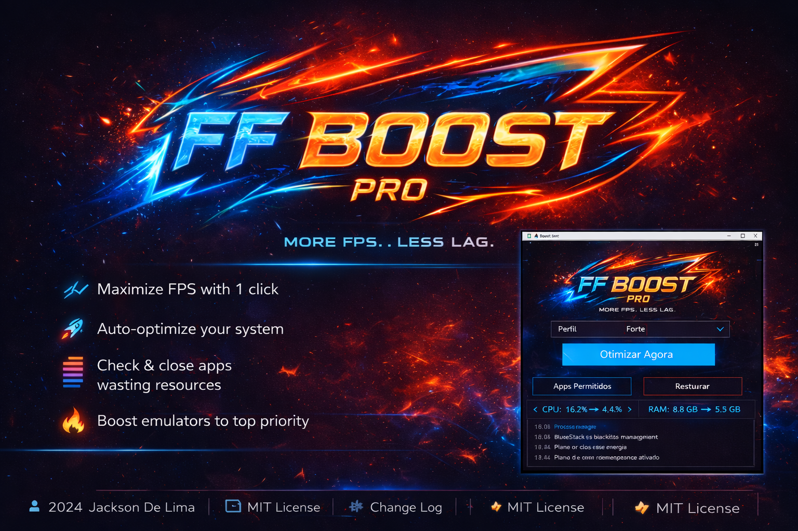

  

<h1 align="center">FF Boost</h1>

  More FPS. Less Lag.

  
  
  

---

## Download

  

---

## Demonstracao

  

---

## Sobre

O **FF Boost** e uma ferramenta de otimizacao de desempenho para jogos em emuladores Android no Windows.

Desenvolvido para:

- Free Fire
- FPS mobile
- jogadores competitivos

---

## O Que Ele Faz

- Aumenta FPS
- Reduz uso de RAM
- Fecha apps inuteis automaticamente
- Prioriza o emulador
- Ativa modo desempenho do Windows

---

## Perfis

| Perfil | Descricao |
|------|--------|
| Seguro | Otimizacao leve |
| Forte | Balanceado |
| Ultra | Maximo desempenho |

---

## Resultado Real

- CPU menor
- RAM menor
- FPS maior
- Gameplay mais fluida

---

## Tecnologias

- C# (.NET)
- WinForms
- Windows API

---

## Como Usar

1. Abra como administrador
2. Escolha o perfil
3. Clique em **Otimizar Agora**

---

## Apoie O Projeto

Se ajudou voce:

- De uma estrela
- Compartilhe com outros players

---

## Autor

Jackson De Lima  
https://github.com/JacksonDeLima
